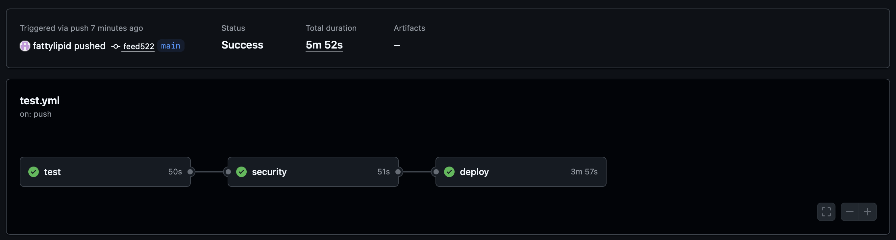
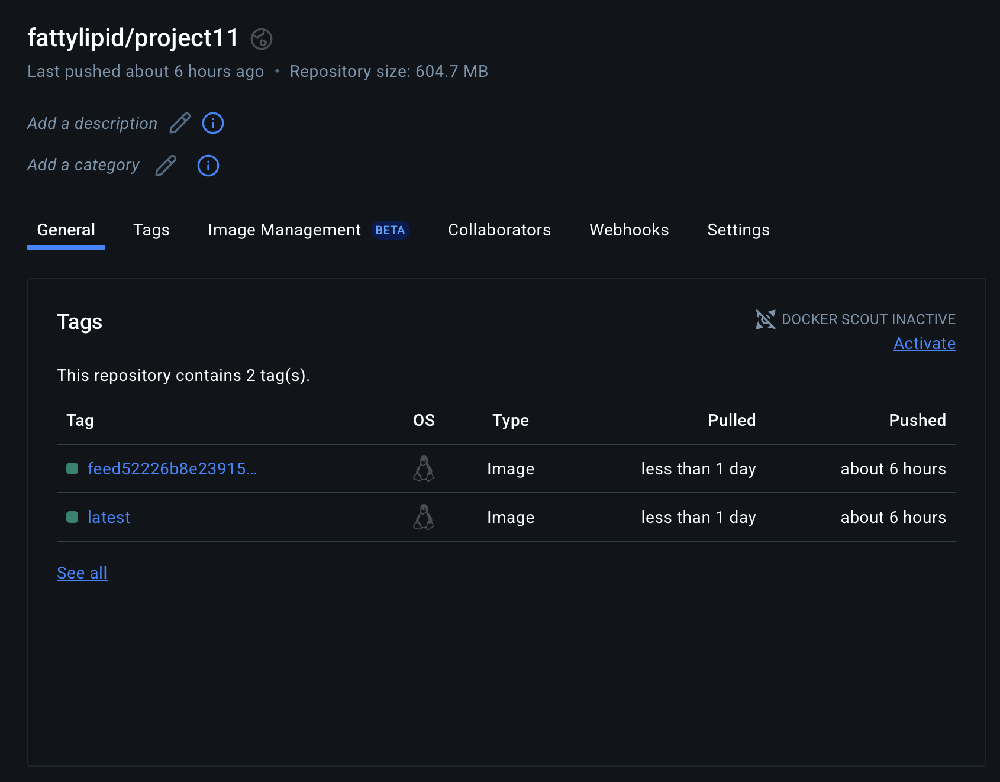

# 🩷 Project 11 - FastAPI Calculator

This project adds a `Calculation` model to a FastAPI app using **SQLAlchemy** and **Pydantic**. It supports basic arithmetic operations (Add, Subtract, Multiply, Divide) and includes robust validation, optional use of the factory design pattern, and a full CI/CD pipeline using GitHub Actions and Docker Hub.

---

## 🩷 GitHub Actions Workflow

## 🩷 Docker Hub Deployment

## 🩷 Docker Image

Click [**here**](https://hub.docker.com/r/fattylipid/project11) for the public image for Project 11.
